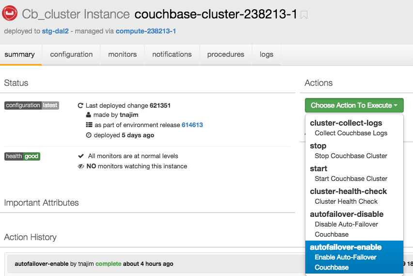
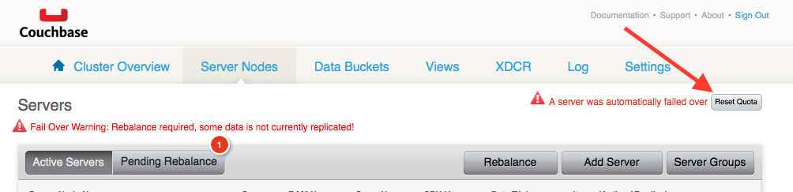

# Couchbase

The following errors are displayed in the OneOps logs when there is a problem with the cluster that prevents the action completing.

* [One or more nodes in the cluster are not active members](#1)
* [One or more nodes in the cluster are not healthy](#2)
* [Rebalance in progress](#3)
* [Bucket x is not part of the cluster](#4)
* [Auto-failover is not enabled](#5)
* [Rebalance is needed](#6)
* [Reset Quota is needed](#7)

##  One or more nodes in the cluster are not active members
A node has been failed over and needs to be added back into the cluster. Go to the admin console to add the inactive node back into the cluster.

##  One or more nodes in the cluster are not healthy
A node is down and needs to be restored. Go to the admin console for more details as well as OneOps to restore the node.

##  Rebalance in progress

A rebalance is currently taking place on the cluster; the rebalance needs to complete before the OneOps action can be executed. Go to the admin console and monitor the rebalance progress until it completes.

NOTE: The rebalance progress can take several minutes, even 30 mins, and may appear to be hung at times; DO NOT cancel the rebalance, it is still working. If the rebalance fails, you will see an error in the admin console.

##  Bucket <name> is not part of the cluster

The bucket that is being updated does not exist; likely because it was removed in the admin console but not in OneOps. Add the bucket back in to the cluster via the admin console or remove the bucket from OneOps.

##  Auto-failover is not enabled

auto-failover is disabled, go to oneops couchbase-cluster component and run action autofailover-enable

##  Rebalance is needed

Couchbase cluster indicates that a rebalance is required. There might be a failed over node. Go to the admin console to evaluate the reason for the rebalance and issue a rebalance if appropriate.

 
##  Reset Quota is needed

Couchbase cluster indicates that a reset quota is needed. A server was automatically failed over. Go to the admin console and click reset quota button

